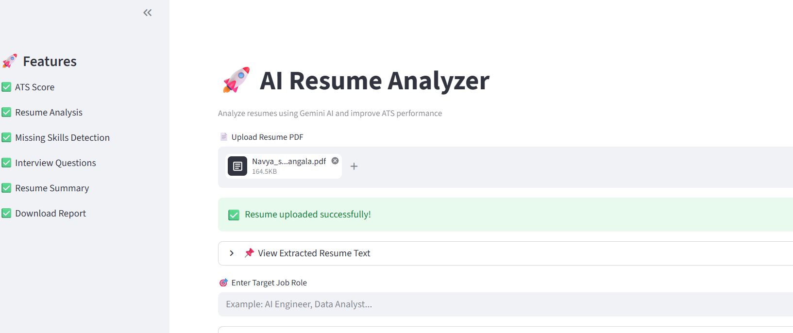
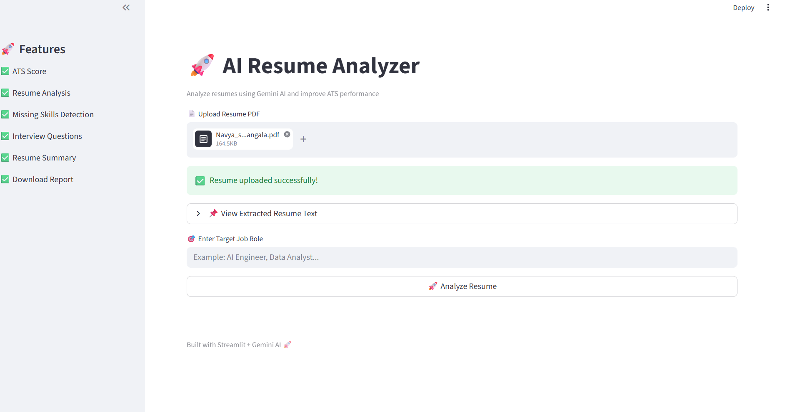
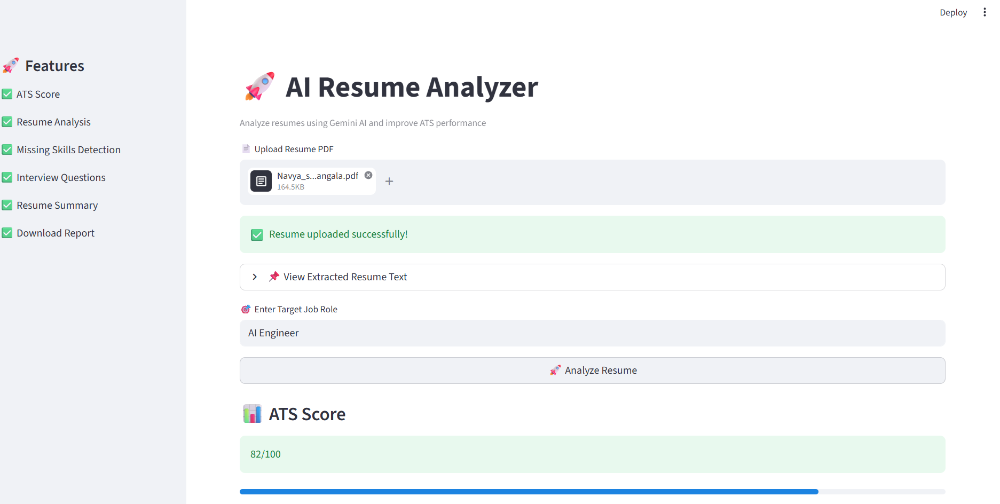
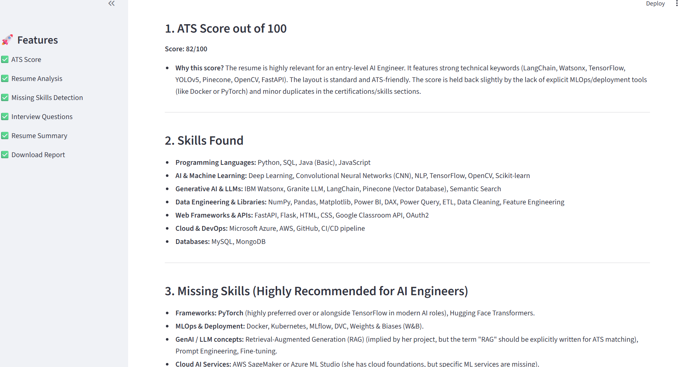
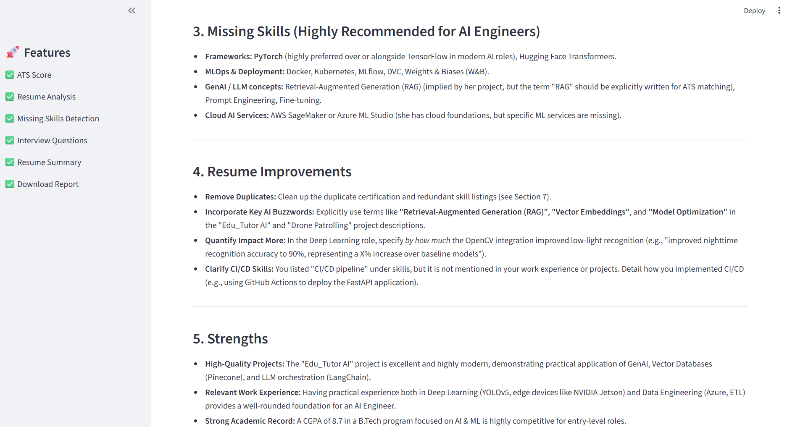
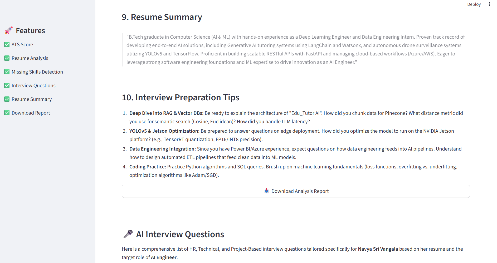
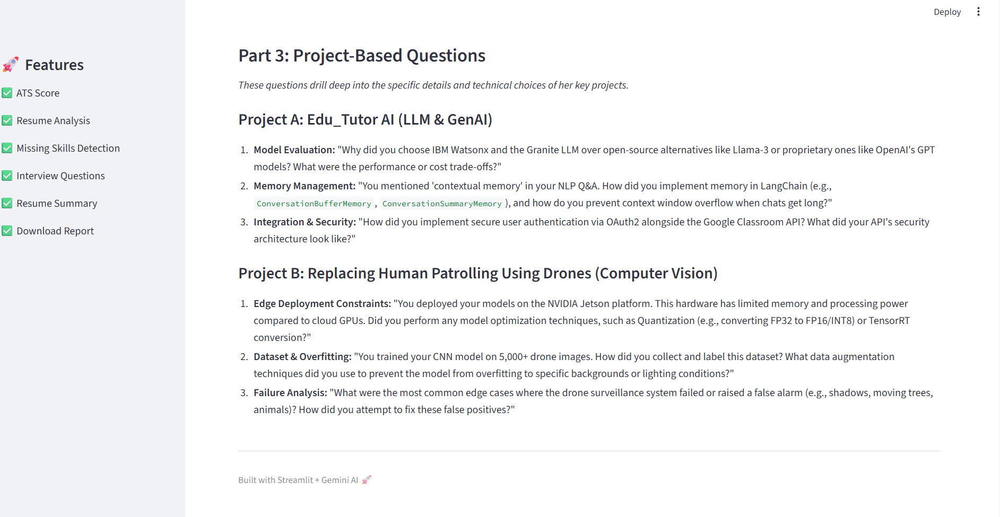

# AI Resume Analyzer

## Project Description

An AI-powered Resume Analyzer built using Streamlit, Google Gemini AI, and PyPDF2.

This application analyzes resumes, extracts skills, detects missing keywords, provides resume improvement suggestions, interview preparation tips, and calculates an ATS score.

---

# Features

- Upload Resume PDF
- Extract Resume Text Automatically
- AI-Powered Resume Analysis
- Detect Skills from Resume
- Find Missing Skills
- Resume Improvement Suggestions
- Interview Preparation Tips
- ATS Score Prediction
- Duplicate Content Detection
- Clean and Responsive UI

---

# Tech Stack

- Python
- Streamlit
- Google Gemini AI
- PyPDF2

---

# Project Structure

```bash
AI-Resume-Analyzer/
│
├── app.py
├── requirements.txt
├── README.md
└── .streamlit/
    └── secrets.toml
```

---

# Installation

## 1. Clone Repository

```bash
git 
clone https://github.com/ellurunandini80-prog/AI-Resume-Analyzer.git
```

## 2. Move into Project Folder

```bash
cd AI-Resume-Analyzer
```

## 3. Install Dependencies

```bash
pip install -r requirements.txt
```

---

# Setup Gemini API Key

Create a folder named:

```bash
.streamlit
```

Inside that folder create:

```bash
secrets.toml
```

Add this inside `secrets.toml`:

```toml
API_KEY = "YOUR_GEMINI_API_KEY"
```

Example Folder Structure:

```bash
.streamlit/
    secrets.toml
```

---

# Run Project

```bash
streamlit run app.py
```

---

# Requirements

```txt
streamlit
google-genai
PyPDF2
```

---

# How It Works

1. Upload Resume PDF
2. Resume text is extracted using PyPDF2
3. Gemini AI analyzes the resume
4. Application provides:
   - Skills Found
   - Missing Skills
   - Resume Improvements
   - Interview Preparation Tips
   - ATS Score

---

# Future Improvements

- Download Analysis as PDF
- Multiple Resume Comparison
- Job Role Specific Analysis
- Resume Keyword Optimization
- Dark Mode UI
- AI Career Suggestions

---

# Screenshots

## 📸 Screenshots

### Home Page


### Resume Upload


### ATS Score


### Skills Analysis


### Resume Improvements


### Analysis Report


### Project Questions


---

# License

This project is for educational and portfolio purposes.